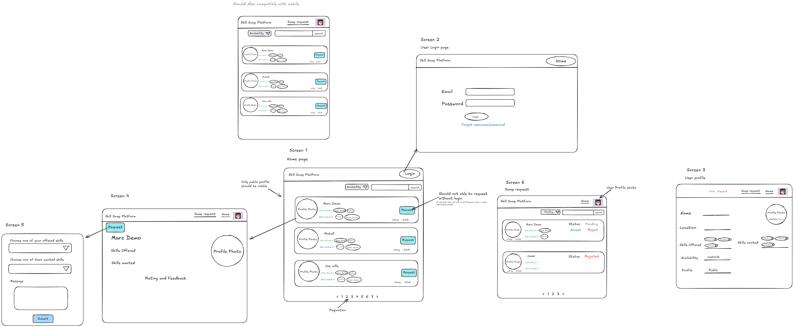
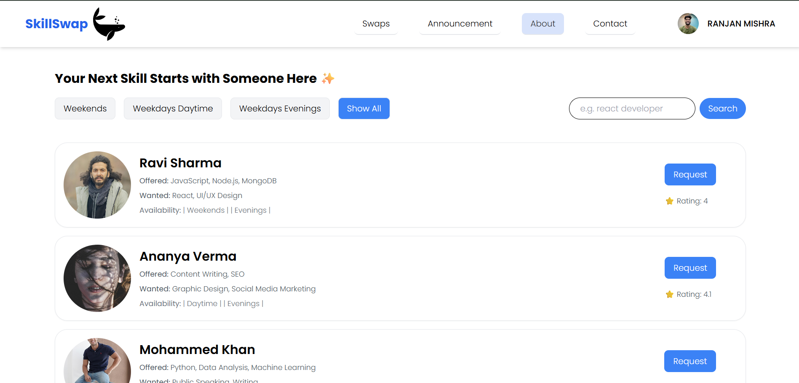
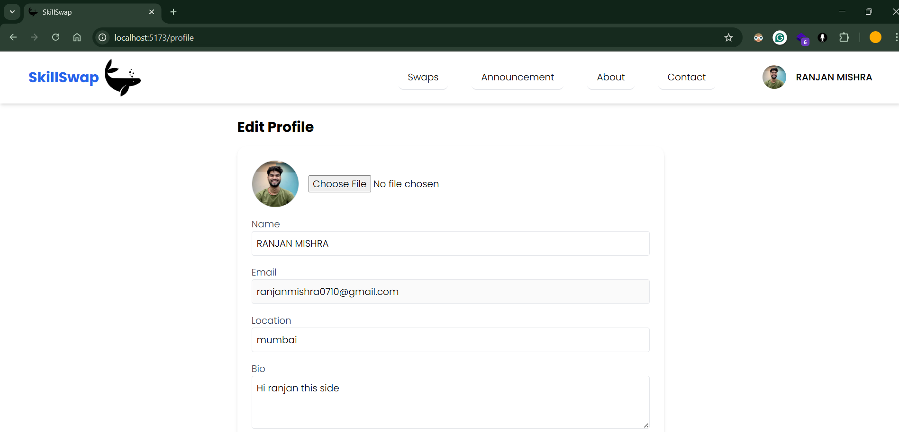
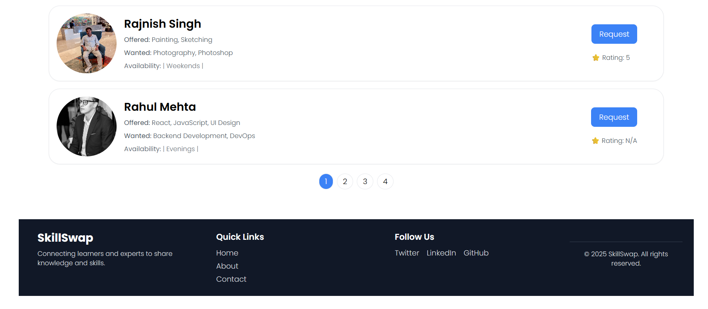
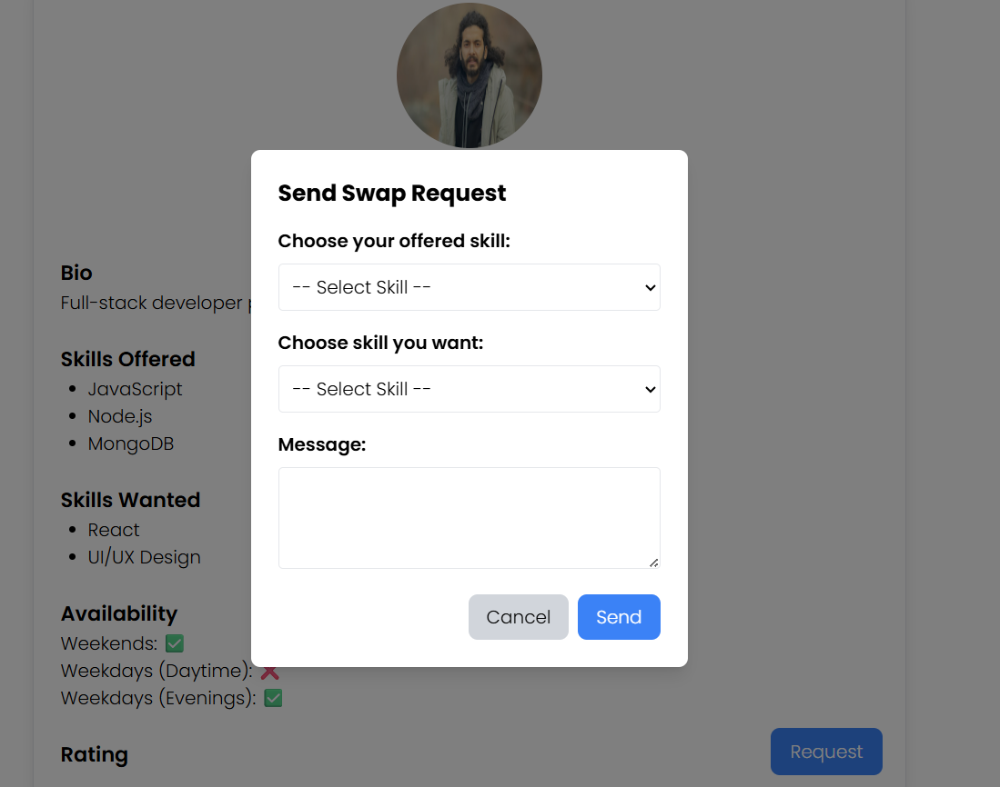
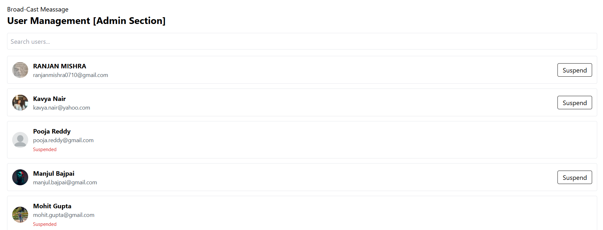

# Skill Swap Platform

A MERN stack Skill Swap Platform where users list skills they offer and request the ones they want.
Features include search, scheduling, real-time updates, feedback, and admin moderation.
Designed where people list skills they **offer**, request skills they **want**, schedule by **availability**, and complete swaps with **requests, acceptance, and feedback**. Includes **public/private profiles**, **search by skill**, **admin moderation**, and **real‑time updates** via Socket.IO.

> 🎥 **Demo video:**  [](https://drive.google.com/file/d/1qYuY3oAX-fiuAasULj_dXDWtUbjpIbK5/view?usp=sharing)]
>
> 🖼️ **Screenshots:**



1. 
2. 
3. 
4. 
5. 


---

## Table of Contents

* [Features](#features)
* [Tech Stack](#tech-stack)
* [Architecture](#architecture)
* [Data Models](#data-models)
* [API](#api)
* [Realtime Events](#realtime-events)
* [Validation](#validation)
* [Security](#security)
* [Project Structure](#project-structure)
* [Getting Started](#getting-started)
* [Environment Variables](#environment-variables)
* [Running](#running)

---

## Features

**Core user features**

* Create profile: name, location, profile photo
* List **skills offered** and **skills wanted**
* Set **availability** (e.g., weekends, evenings)
* Toggle **Public / Private** profile
* **Search/browse** others by skill or name
* **Request swap**, **accept / reject**, or **delete** unaccepted requests
* View **current** and **pending** swaps (filter/pagination)
* **Rate or leave feedback** after a completed swap

**Admin features**

* Reject inappropriate/spammy skill descriptions
* **Ban / unban users** violating policy
* Send **platform‑wide announcements**

**Nice touches**

* Toast notifications, form validation, optimistic UI
* Image upload to Cloudinary (via Multer)
* Auth via JWT (HTTP‑only cookie or header)
* Real‑time request status with **Socket.IO**
* Zod schemas shared (where relevant) for consistent validation

---

## Tech Stack

**Frontend**: React (Vite), React Router, Zustand, React Hook Form, React Select, React‑Toastify, Axios

**Backend**: Node.js, Express, Mongoose, Multer, Cloudinary SDK, Zod, Socket.IO

**Auth & Security**: bcrypt, JSON Web Token, Helmet, CORS

**Dev Tools**: Nodemon, ESLint, Prettier

---

## Architecture

```
Client (React + Zustand)
  ├─ Pages: Home, Login, Profile, Requests, Admin
  ├─ Components: SkillCard, RequestModal, RatingForm, Pagination
  ├─ State: authStore, profileStore, requestsStore
  └─ API: axios (interceptors for auth)

Server (Express)
  ├─ routes: /auth, /users, /skills, /swaps, /feedback, /admin, /reports
  ├─ middleware: auth, admin, validate(zod), multerUpload, errorHandler
  ├─ services: cloudinary, email/notify, csv
  ├─ sockets: requestStatus, announcements
  └─ models: User, SwapRequest, Feedback, Announcement

DB (MongoDB)
```

---

## Data Models

### User

```ts
{
  _id: ObjectId,
  name: String,               // required
  email: String,              // unique, required
  passwordHash: String,       // bcrypt
  location?: String,
  avatarUrl?: String,
  skillsOffered: [String],    // index
  skillsWanted: [String],     // index
  availability: [String],     // e.g., ["weekends", "evenings"]
  isPublic: Boolean,          // profile visibility
  role: 'user' | 'admin',
  banned: Boolean,
  rating: Number,             // avg rating
  createdAt: Date,
  updatedAt: Date
}
```

### SwapRequest

```ts
{
  _id: ObjectId,
  fromUser: ObjectId,         // requester
  toUser: ObjectId,           // target
  offeredSkill: String,
  wantedSkill: String,
  message?: String,
  status: 'pending' | 'accepted' | 'rejected' | 'cancelled' | 'completed',
  createdAt: Date,
  updatedAt: Date
}
```

### Feedback

```ts
{
  _id: ObjectId,
  swapId: ObjectId,
  fromUser: ObjectId,         // who gives feedback
  toUser: ObjectId,           // who receives feedback
  rating: Number,             // 1..5
  comment?: String,
  createdAt: Date
}
```

### Announcement (Admin)

```ts
{
  _id: ObjectId,
  title: String,
  body: String,
  createdAt: Date,
  createdBy: ObjectId // admin
}
```

---

## API

**Auth**

* `POST /api/auth/register` – create account
* `POST /api/auth/login` – login, returns JWT
* `POST /api/auth/logout` – invalidate token

**Users**

* `GET /api/users` – list public users, search by `?search=` (name/skills), filter `?availability=weekends`, paginate `?page=`
* `GET /api/users/:id` – public profile
* `PUT /api/users/me` – update own profile (name, location, skills, availability, isPublic)
* `PUT /api/users/me/avatar` – upload avatar (Multer → Cloudinary)

**Swaps**

* `POST /api/swaps` – create request `{ toUser, offeredSkill, wantedSkill, message }`
* `GET /api/swaps` – list my swaps (`status` filter: pending/accepted/rejected/completed)
* `PATCH /api/swaps/:id/accept`
* `PATCH /api/swaps/:id/reject`
* `PATCH /api/swaps/:id/cancel` – requester can cancel while pending
* `PATCH /api/swaps/:id/complete` – mark as completed
* `DELETE /api/swaps/:id` – delete if not accepted (business rule)

**Feedback**

* `POST /api/feedback` – leave feedback `{ swapId, toUser, rating, comment }`
* `GET /api/feedback/user/:id` – list feedback for a user

**Admin** (requires admin role)

* `GET /api/admin/users` – list with moderation data
* `PATCH /api/admin/users/:id/ban` – ban/unban
* `PATCH /api/admin/skills/reject` – moderate skill descriptions
* `GET /api/admin/swaps` – monitor swaps
* `POST /api/admin/announcements` – platform‑wide message
* `GET /api/admin/reports/:type` – CSV export (`users|feedback|swaps`)

> ⚠️ **Rule**: Search results only include profiles where `isPublic === true`.

**Example Search**

```
GET /api/users?search=excel&page=1
```

**Example Pagination**

```
page = Number(req.query.page || 1)
limit = 20
skip = (page - 1) * limit
```

---

## Realtime Events

**Namespace:** `/swaps`

* `client → server: createSwap` – payload: `{ toUser, offeredSkill, wantedSkill }`
* `server → client: swapUpdated` – payload: `{ swapId, status }`
* `server → room(userId): announcement` – admin broadcast

Rooms: each user joins room `user:{_id}` after auth handshake.

---

## Validation

* All request bodies validated with **Zod** schemas (shared types inferred on client where applicable).
* File types/size checked for avatar uploads.
* Server returns structured errors consumed by React‑Toastify.

---

## Security

* Passwords hashed with **bcrypt**
* JWT with short expiry + refresh (optional) stored as **HTTP‑only cookie** or Authorization header
* **Helmet** for sensible headers
* **CORS** allowlist for client origin
* Rate limiting (add express‑rate‑limit)
* Access control: `auth` and `admin` middlewares

---

## Project Structure

```
skill-swap/
├── client/                     # Vite React app
│   ├── src/
│   │   ├── api/axios.ts
│   │   ├── store/
│   │   ├── pages/
│   │   ├── components/
│   │   ├── hooks/
│   │   └── utils/
│   ├── index.html
│   └── vite.config.ts
├── server/
│   ├── src/
│   │   ├── index.ts
│   │   ├── app.ts
│   │   ├── config/
│   │   ├── routes/
│   │   ├── controllers/
│   │   ├── middleware/
│   │   ├── models/
│   │   ├── services/          # cloudinary, csv, mail
│   │   └── sockets/
│   ├── .env.example
│   └── package.json
├── README.md
└── package.json               # root scripts
```

---

## Getting Started

### Prerequisites

* Node.js 18+
* MongoDB (Atlas or local)
* Cloudinary account (for image storage)

### Clone

```bash
git clone https://github.com/yourname/skill-swap.git
cd skill-swap
```

### Install

```bash
# backend
cd server && npm install
# frontend
cd ../client && npm install
```

---

## Environment Variables

Create **server/.env** from `.env.example`:

```bash
PORT=5000
MONGO_URI=mongodb+srv://...
JWT_SECRET=supersecret
CORS_ORIGIN=http://localhost:5173
CLOUDINARY_CLOUD_NAME=xxxx
CLOUDINARY_API_KEY=xxxx
CLOUDINARY_API_SECRET=xxxx
```

Create **client/.env**:

```bash
VITE_API_URL=http://localhost:5000
VITE_SOCKET_URL=http://localhost:5000
```

---

## Running

```bash
# terminal 1
cd server
npm run dev       # nodemon + ts-node or node

# terminal 2
cd client
npm run dev       # vite on :5173
```
### Notes

* Search results filter: `isPublic=true`.
* Banned users cannot submit requests (UI disables submit; API rejects with 403).
* Request deletion allowed only while status = `pending`.


